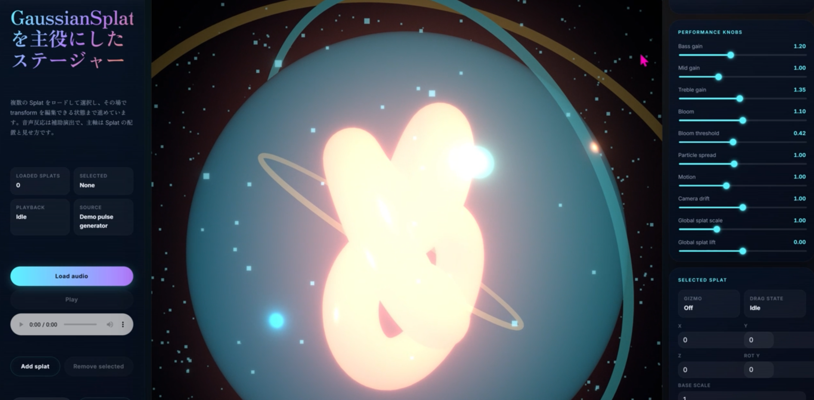

# 3GS Audio Reactive Visualiser

GaussianSplatting データを主役にした Web ビューワー兼プレイグラウンドです。

目的は、Splat を複数読み込み、配置・変形・演出を加えて遊べる基盤を作ることです。音声反応は補助機能であり、メインは Splat ビューワーとしての体験です。

## 現在の機能

- 複数 Gaussian Splat のローカル読込
  - `.ply`
  - `.splat`
  - `.ksplat`
  - `.spz`
- Splat outliner
- 選択中 Splat の数値 transform 編集
- `TransformControls` による gizmo 編集
- scene export / import
- import 時の複数ファイル remap pending 対応
- procedural 背景演出
- 音声反応による追加演出

## 技術構成

- Vite
- React 19
- TypeScript
- Three.js
- `@react-three/fiber`
- `@react-three/drei`
- `@react-three/postprocessing`
- `postprocessing`
- `@mkkellogg/gaussian-splats-3d`

## 開発

```bash
npm install
npm run dev
```

## License

This project is proprietary. All rights reserved.

## Demo Preview



## ビルド

```bash
npm run build
```

## ドキュメント

- `docs/SPEC_CURRENT.md`
- `docs/DEVLOG_2026-03-23.md`
- `docs/GPTlog`

## 未実装

- scene graph / layer 管理
- 画像 / 動画 / glTF 統合
- multi-select
- pointer-based placement
- 録画向けプリセット
- asset 自動再解決付き import

## 次に進める候補

1. scene graph / layer 管理
2. 画像 / 動画 / glTF の添景統合
3. pointer-based placement と multi-select
4. 録画向け burst / converge プリセット
5. bundle 分割
